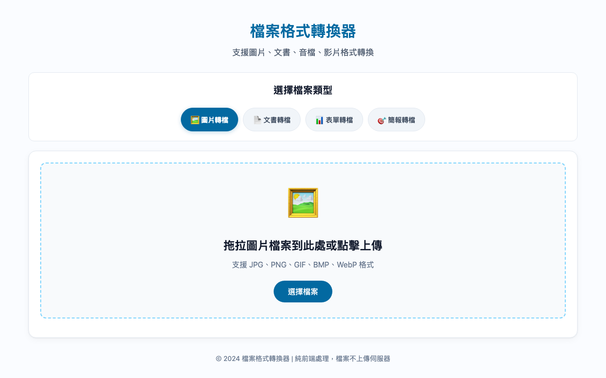

# 檔案格式轉換器 使用說明

## 這是什麼？
在瀏覽器中轉換圖片、文書、表單、簡報等檔案格式。所有處理在本機完成，檔案不上傳伺服器。

## 使用方式
1. 選擇檔案類型（圖片/文書/表單/簡報）
2. 拖拉檔案到上傳區，或點擊選擇檔案
3. 選擇目標格式與品質設定
4. 點擊「開始轉換」
5. 下載轉換後的檔案

## 功能特色
- 圖片轉檔：JPG、PNG、GIF、BMP、WebP 互轉
- 文書轉檔：支援常見文件格式
- 純前端處理，隱私安全
- 支援批次轉換
- 可調整輸出品質

## 注意事項
- 檔案不會上傳到任何伺服器
- 超大檔案轉換可能需要較長時間
